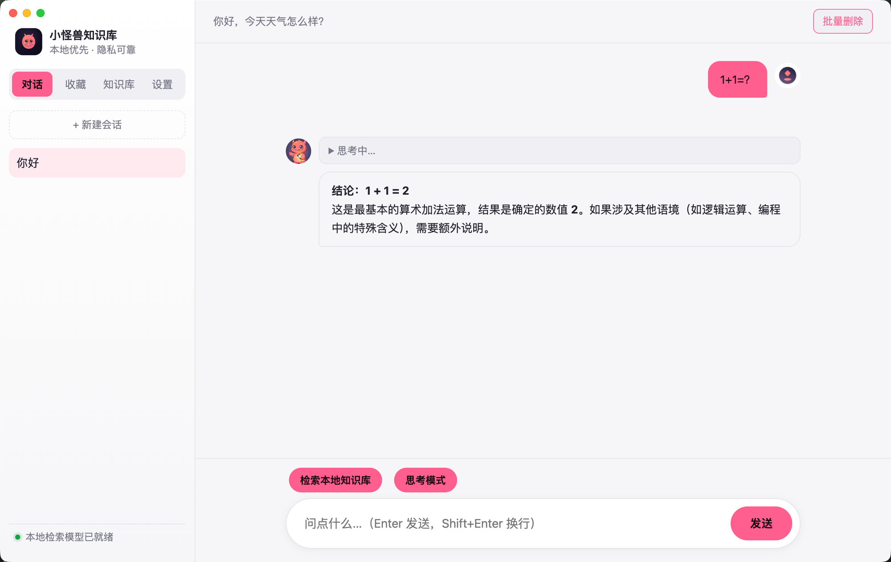
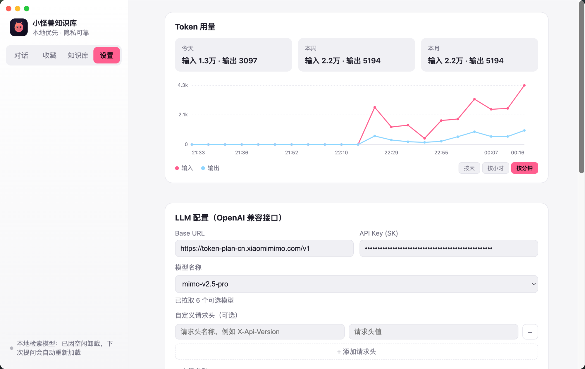

# 🐲 knowhoard (小怪兽知识库)

[](./LICENSE)
[](#)
[](#-why-this-exists)

A **local-first** personal knowledge base desktop app. Point it at your Word / PDF / Markdown files, or an entire Obsidian vault — it indexes everything locally and lets you ask questions against your own notes using any OpenAI-compatible LLM you configure. Answers are grounded with citations back to the exact source document.

📖 [中文文档](./README.zh-CN.md)





---

## 🤔 Why this exists

Most personal knowledge base tools (e.g. AnythingLLM) use a "workspace" as the retrieval boundary — you have to manually pick documents and embed them into a specific workspace, and newly added notes don't automatically join the index. For a personal notes vault that keeps growing over time, that model is backwards: you should configure your sources **once**, and every conversation after that should search everything automatically.

That's the model this app follows: once your sources are configured, every conversation can retrieve from your full indexed content by default — no separate "pick documents" step, ever.

---

## ✨ Features

- 💬 **Chat with your notes** — streaming Markdown answers, LaTeX (KaTeX), Mermaid diagrams, syntax-highlighted code blocks
- 🔍 **Hybrid retrieval** — vector search + keyword search + filename/path matching, fused and reranked
- 🗂️ **Obsidian vault connector** — point at a vault, everything inside gets indexed and kept in sync
- 📄 **Multi-format ingestion** — Markdown, plain text, `.docx`, `.pdf`
- 🔗 **Cited answers** — every response links back to the exact source document(s) it drew from, click-to-reveal in Finder
- ⭐ **Favorites** — star any answer and revisit it from a dedicated tab
- 🧠 **Thinking mode** — surfaces the model's reasoning trace when the upstream model supports it, auto-detected
- 🛠️ **MCP tool calling** — bring your own MCP servers (same config shape as Claude Desktop), toggle tool use per conversation
- 📊 **Token usage dashboard** — input/output token charts by day / hour / minute, with running totals
- 🔄 **Incremental sync** — MD5 content hashing means unchanged files are skipped entirely; deleted files are cleaned out of the index automatically
- 🌓 **Idle-aware resource management** — the local AI model auto-unloads only when idle *and* the system is genuinely busy, and reloads transparently
- 🔐 **Privacy by design** — nothing leaves your machine except the prompt you send to *your own* configured LLM endpoint

---

## 💡 What's different (the innovation points)

- **No "workspace" busywork.** Competing tools force you to manually assign documents to a workspace before they're searchable. Here, indexing and retrieval scope are the same thing — add a source, it's searchable, full stop.
- **Retrieval decisions are made by the model, not brittle client-side rules.** Instead of hand-written heuristics guessing whether a short message like `"1"` deserves a knowledge-base search, retrieval always runs (it's free and local) and the system prompt lets the LLM itself judge whether the retrieved content is actually relevant — closer to how a human assistant would use reference material.
- **Consistent citation numbering.** Retrieved chunks are grouped by source document *before* being numbered, so the `[来源N]` markers the model uses in its answer always line up 1:1 with the citation chips shown in the UI — including when multiple chunks from the same document are retrieved.
- **Citations are filtered to what's actually used.** The UI only shows citation chips for sources the model actually referenced in its answer, not everything that was retrieved — less noise, and no accidental exposure of filenames the model chose not to use.
- **A real hybrid retrieval pipeline, not just vector search.** Filename/path matching is fused in via Reciprocal Rank Fusion alongside vector and keyword search, specifically to cover "I remember the file name but not the content" — a common query pattern that pure semantic search misses.

---

## 🚀 Quick start

```bash
git clone git@github.com:lymboy/knowhoard.git
cd knowhoard
npm install
npm start
```

That's it — the app window opens, walk through the first-run onboarding, point it at a folder or an Obsidian vault, and start asking questions.

> Prerequisites: Node.js 18+ (developed on Node 24), macOS (native modules need to compile locally).

If the first launch throws a `NODE_MODULE_VERSION` mismatch (Electron's bundled Node ABI differs from your system Node — native modules like `better-sqlite3` need rebuilding against Electron's ABI), run:

```bash
npx electron-rebuild -f -w better-sqlite3
```

To build a distributable macOS app:

```bash
npm run dist    # produces a DMG under dist/
```

The app isn't code-signed or notarized yet — on another machine, first launch requires manually allowing it (System Settings → Privacy & Security).

---

## 🛠️ Tech stack

| Layer | Choice |
|---|---|
| Runtime | Electron (macOS packaging only for now) |
| Local embedding + rerank | `@xenova/transformers` (transformers.js / ONNX, pure JS, no Python/GPU), in a dedicated `worker_thread` |
| Vector store | `@lancedb/lancedb` (embedded, no server to run) |
| Metadata store | `better-sqlite3`, FTS5 trigram tokenizer for CJK keyword search |
| Document parsing | native `.md`/`.txt`, `mammoth` for `.docx`, `pdf-parse` for `.pdf` |
| Rendering | `marked` + `DOMPurify`, `mermaid`, KaTeX, custom syntax highlighting |
| Agent tools | `@modelcontextprotocol/sdk` (MCP, stdio transport) |

---

## 🗂️ Project layout

```
main/                  # Electron main process
  db/                   # SQLite schema, gzip helpers
  vector/                # LanceDB wrapper
  ai/                    # local embedding/rerank worker, LLM client, agent loop
  ingest/                # chunking, file parsers, Obsidian connector, MD5 incremental sync
  rag/                   # hybrid retrieval
  mcp/                   # MCP client management
  index.js / ipc.js / preload.js / settings.js
renderer/               # renderer process (no bundler; consumes UMD/ESM builds from node_modules directly)
  index.html / app.js / styles.css
  vendor-src/, vendor/   # highlight.js ships no ready-made browser global build, so esbuild bundles a small one
build/                  # icons, mascot artwork, electron-builder output directory
```

---

## ⚙️ Configuration

Settings are entered from the in-app "设置" (Settings) page and persisted to `~/Library/Application Support/小怪兽知识库/settings.json`:

| Setting | Required | Notes |
|---|---|---|
| 🔑 LLM Base URL | Yes | An OpenAI-compatible `/v1` endpoint |
| 🔑 API Key (SK) | Yes | Your own key |
| 🤖 Model name | Yes | e.g. `deepseek-chat`, `gpt-4o` |
| 🧾 Custom headers | No | Some gateways require extra headers |
| 🎛️ temperature / top_p / top_k / max_tokens | No | Advanced params, defaults used when blank |
| 📝 System prompt | No | Falls back to the built-in default when blank |
| 🛠️ MCP servers | No | JSON, same shape as Claude Desktop's `mcpServers` |

`autoSyncOnLaunch` (default `true`) and `autoSyncIntervalMinutes` (default `20`) can currently only be changed by editing `settings.json` directly — no UI toggle yet. They control an automatic MD5-diff sync pass that runs on launch and every N minutes afterward: changed/new files get re-indexed, and files removed from disk have their index and vectors cleaned up too — without you having to remember to click "sync".

The embedding/rerank models are fixed in code (`bge-small-zh-v1.5` + `bge-reranker-base`); they're downloaded from Hugging Face and cached locally on first use, then run fully offline after that.

## 💾 Data storage location

Everything lives under `~/Library/Application Support/小怪兽知识库/`:

- `kb.sqlite3` — document metadata, chunk text, conversation history (gzip-compressed), favorites
- `lancedb/` — vector data
- `models/` — cached local embedding/rerank models
- `settings.json` — configuration

---

## 🗺️ Roadmap / known limitations

- 🖼️ **OCR** — scanned/image-only PDFs have no text layer and aren't supported; flagged as failed to index.
- 🧵 **Cross-session long-term memory** — memory today is scoped to a single conversation. Planned: a separate fact-memory table, periodically distilling preferences from conversations, retrieved and injected into new conversations, with expiry/update support.
- 🧩 **Skill loading** — the tool architecture already treats MCP tools and future Skill-loaded tools as one pool; no Skill directory UI yet. Planned to support `~/.claude/skills/`-style directories directly.
- 🎙️ **Voice input** — not yet implemented; planned support for a configurable speech-to-text model.
- 🖼️ **Images / more file types + object storage** — not yet implemented; planned object storage backend (e.g. Aliyun OSS / Tencent COS) paired with a vision model.
- 🔔 **Update checks** — not yet implemented; planned to query the GitHub Releases API on launch.
- 🪟 **Cross-platform** — Linux (AppImage) / Windows (NSIS) targets are already declared in `package.json`, but only macOS has actually been verified.

---

## 📄 License

MIT — see [LICENSE](./LICENSE). You're free to use this project for any purpose, **including commercial use**, as long as you keep the copyright notice and license text — i.e. credit this repository as the source.
