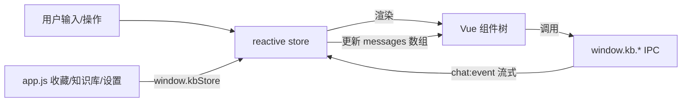

# 渲染层迁移 Vue 3 —— 对话层（首期）设计

日期：2026-08-02
范围：P1-5a。把渲染层的「对话层」从原生 JS 手搓 DOM 迁到 Vue 3，建立 Vue 基建供后续视图逐个迁移。功能不变，只换实现。

## 1. 背景与动机

`renderer/app.js`（1385 行）用原生 JS 手搓 DOM，对话层（188–759 行）是病根：

- 状态从 DOM 反推，而非 DOM 从状态派生。`currentBubbleRefs` / `currentToolCallsEl` / `currentUserMsgEl` 一堆指令式 DOM 引用，列表一重建引用就成幽灵节点（双击重命名那段注释把这事写得很清楚：click 先触发 loadConversations 重建 DOM，dblclick 时捕获的 titleEl 已是不在文档里的旧节点）。
- tool-call / tool-result 靠遍历 DOM 子节点按 callId/name 匹配，同名调用串台。
- 主题、reasoning 显示、tool-result 匹配反复出 bug，全是这类「状态与 DOM 脱节」的同一个根因。

Vue 把 `messages[]` 变成唯一真相源，DOM 从状态派生，这一整类 bug 结构上消失。这是 v0.3.0 的事，先做对话层。

## 2. 范围

**本期做（对话层 + Vue 基建）：**
- Vue 引入与构建链路
- reactive store（对话相关状态）
- 会话列表（侧边栏 `#conversationList`）
- AI 状态栏（侧边栏 `#aiStatus`）
- chat 视图（消息列表 + composer + 流式接线 + 工具/思考折叠块 + 引用 chip + 气泡操作）
- 与 app.js（收藏/知识库/设置视图）共存

**后续逐个迁（不在本期）：** 收藏视图、知识库视图、设置视图、onboarding/confirm 弹窗、清空 app.js。

## 3. 关键决策

### 3.1 Vue 引入方式：SFC 预编译 + 纯运行时（用户拍板：安全第一）

- 引 `vue.runtime.esm-browser.prod.js`（纯运行时，无模板编译器）到 `renderer/vendor/`。
- 组件用 `.vue` SFC 写，靠现有 `scripts/build-vendor.js` 的 esbuild + 新增 `@vue/compiler-sfc` 预编译成 JS render 函数，产物放 `renderer/vendor/components/`。
- **CSP 保持 `script-src 'self'` 不变**，不需要 `'unsafe-eval'`。这是用户明确的安全姿态要求。
- 代价是引入 `.vue` 编译步骤，但构建由 `build:vendor` 自动跑（`prestart`/`predist` 已挂），用户无感。

### 3.2 状态管理：单 reactive store，不引 Pinia

对话层状态量不大，用一个 `reactive` 对象模块即可，依赖面最小。状态字段从现有 `state` 对象 + 散落变量收敛而来：

```
store = reactive({
  view, conversations, activeConversationId, settings, mcpHasTools,
  toolsEnabled, thinkingSupported, sending, selecting, selectedMessageIds: Set,
  // 对话层新增：消息作为唯一真相源
  messages: [],            // 当前会话的消息数组，每条 { id, role, content, reasoning, citations, toolCalls, favorited, streaming }
  pageState,               // 分页游标
  aiStatus,                // { text, dotClass }
})
```

流式事件不再去操作 DOM，而是更新 `messages` 里对应那条的 `content` / `reasoning` / `toolCalls`，Vue 自动重渲染。

### 3.3 共存策略

3 个 Vue mount 点共用一个 store：`#conversationList`、`#aiStatus`、`#view-chat` 内新增 `#chat-root`。

收藏/知识库/设置视图暂留原生 app.js（经典脚本继续管）。app.js 与 Vue 模块通过 `window.kb`（已有 IPC 桥）+ 一个 `window.kbStore` 桥接（Vue 暴露 store 的方法给 app.js 调，如切会话时 app.js 调 `kbStore.loadConversation(id)`）。

视图切换 `switchView` 仍由 app.js 持有，chat 视图激活时 Vue mount 点可见，其余视图 Vue mount 点不卸载（保持对话状态）。

### 3.4 不变的硬约束（来自 CLAUDE.md）

- 气泡正文 14px、列表项 13px 不改（用户明确嫌大过）。
- 气泡内样式跟随亮/暗主题，不硬编码颜色。
- Mermaid 主题按 `document.documentElement.dataset.theme` 选亮/暗变量。
- 工具开关只在设置页，对话区无感。
- 引用编号 = 检索 chunk + 工具读取来源，连续编号（后端已做，前端只渲染）。

## 4. 组件结构

```
renderer/
  vendor-src/
    vue-entry.js                 # 引 vue runtime + 挂载根，ESM
    components/
      ConversationList.vue       # 会话列表 + 新建 + 重命名 + 删除
      AiStatus.vue               # AI 状态栏
      ChatView.vue               # chat 视图根：消息列表 + composer
      MessageBubble.vue          # 单条气泡（reasoning/toolCalls/bubble/citations/actions）
      ToolCallsBlock.vue         # 工具调用折叠块
      CitationChips.vue          # 引用 chip
      Composer.vue               # 输入框 + 发送 + mode 切换
  vendor/
    vue.runtime.bundle.js        # 预编译产物
    components/*.js              # SFC 编译产物
  app-vue.js                     # ESM 入口，建 store + 挂 3 个 mount 点
  app.js                         # 暂留：收藏/知识库/设置 + onboarding/confirm + 初始化
  store.js                       # reactive store 模块（ESM）
```

`app-vue.js` 与 `app.js` 都用 `<script type="module">`/经典脚本，通过 `window.kbStore` 通信。Markdown 渲染（marked+DOMPurify+hljs+mermaid+katex）逻辑从 app.js 抽成 `markdown.js` 共享模块，两边都用。

## 5. 数据流



流式问答：`kb.chat.onEvent` 回调不再操作 DOM，改为更新 `store.messages` 里当前流式那条的 `streaming`/`content`/`reasoning`/`toolCalls`，Vue 响应式重渲染。`scrollToBottomIfFollowing` 改为 `watch` messages 长度 + nextTick。

## 6. 迁移顺序（本期内）

1. **基建**：装 `@vue/compiler-sfc`、扩 `build-vendor.js` 编译 `.vue`、引 vue runtime。CSP 无需改——`script-src 'self'` 已允许同源 `type="module"` 脚本。
2. **store + markdown 共享模块**：抽 `store.js`、`markdown.js`，app.js 改用共享模块（暂不删 app.js 原地实现，先并存验证）。
3. **AiStatus.vue**：最小组件，先跑通 mount + reactive。
4. **ConversationList.vue**：会话列表迁过来，双击重命名用 Vue 事件而非 setTimeout 分辨。
5. **ChatView + MessageBubble + ToolCallsBlock + CitationChips + Composer**：对话层主体。流式接线迁到 store。
6. **app.js 收尾**：删除已迁的对话层代码，保留其余视图；`switchView` 接 Vue mount 点可见性。

每步 `npm start` 验证一步走一步。

## 7. 风险与回滚

- 共存期两套 DOM 逻辑并存，切会话状态可能不一致 → 先用 store 单一真相源，app.js 切会话调 store 方法，不各自维护。
- Vue runtime ESM 在 Electron renderer 的 CSP 下需确认 `script-src 'self'` 允许 `type=module`（允许，self 包含同源 module）。
- 回滚点：每步独立提交，任一步出问题 revert 单个 commit 即可，不影响已提交的对话层之前的改动。

## 8. 验收

- 对话层全部交互与现状一致：发消息/流式/停止/思考折叠/工具折叠/引用 chip 点击/收藏/批量删除/分页/会话重命名删除。
- 主题切换（亮/暗）气泡内样式正常。
- CSP 仍为 `script-src 'self'`，控制台无 CSP 违规。
- app.js 收藏/知识库/设置视图不受影响。
