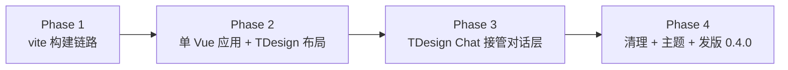

# V2 重构设计 —— vite 正规构建 + TDesign 全家桶

日期：2026-08-03
分支：`refactor/v2-vite`
范围：渲染层从「免构建（手拼 SFC + esbuild bundle）」整体迁到「vite 正规构建 + npm 生态」。布局/通用组件用 `tdesign-vue-next`，对话层用 `@tdesign-vue-next/chat`。功能不变，换实现 + 换 UI 库。

## 1. 背景与动机

免构建是技术选型，不是 Electron 约束，但代价已经累积到拖累迭代：

- 手拼 SFC 编译（`build-vue.js`）、esbuild 打包 TDesign Chat（`build-chat-ui.js`，产出 6.2MB 死重且 index.html 根本没引用）、vendor 全靠 window 全局、3 个 Vue mount 点 + `app.js` 共存。
- `getCurrentInstance` 在预编译环境返回 null，导致 TDesign Chat 组件实例链断裂、`refs/slots` 为 null，原生 import 这条路被堵死。
- 每加一个成熟组件都要跟免构建的妥协搏斗，违背「个人工具、短平快、稳定可靠、复用开源」的初衷。

V2 用 vite 正规构建后：Vue 单实例、组件实例链正常、TDesign 原生 `import`、vendor 走 npm、一套设计系统。免构建踩的坑结构上消失，不是逐个修。

## 2. 范围

一次性大改，分 4 期，每期 `npm start` 可验证：

- 构建链路：vite 替代 `build-vendor`，产物 `renderer/dist`，Electron 加载 dist
- 单 Vue 应用：1 个 `#app` mount，视图切换在 Vue 内，删 `app.js`
- 布局/通用：`tdesign-vue-next` 接管侧边栏/设置/知识库/收藏/弹窗
- 对话层：`@tdesign-vue-next/chat` 接管消息列表/composer/markdown
- vendor：`marked`/`dompurify`/`highlight.js`/`mermaid`/`katex` 改 npm import
- 主题：TDesign theme-mode + `data-theme` 亮暗切换落地
- 清理旧产物 + 发版 v0.4.0

## 3. 关键决策

### 3.1 构建链路：vite，产物 renderer/dist

`vite.config.js` 已就绪（`root=renderer`、`base="./"` 适配 Electron file://、`plugin-vue`、产物 `dist`）。`renderer/dist/` 之前已成功产出过（含 katex 字体），半截失败在 vendor/app.js 迁移，不在 build 本身——V2 全押 vite 后该集成问题消失。

- `main/index.js` 第 135 行 `loadFile` 改 `renderer/dist/index.html`。
- `package.json` scripts：`build:renderer: vite build`，`prestart`/`predist` 调它，删 `build:vendor`。
- `electron-builder` 的 `files` 改 `renderer/dist/**/*`（不再 glob 整个 renderer，去掉 vendor 旧产物和 vendor-src 源）。
- CSP 保持 `script-src 'self'`（vite 产物是正经 ESM bundle，无 eval）。

### 3.2 单 Vue 应用，删 app.js

从 3 个 mount 点（AiStatus/ConversationList/ChatView）+ `app.js` 共存，改成 1 个 Vue 应用挂 `#app`，`App.vue` 内部按 view 切换（chat/favorites/knowledge/settings）。

`app.js`（916 行）持有的视图切换、onboarding/confirm 弹窗、初始化逻辑全迁 Vue。`store.js` 去掉 `window.__STORE` / `window.__STORE_API` 桥接 hack——vite 下 ESM import 时序正常，组件直接 `import { store }` 即可，不再需要全局挂载绕时序。

### 3.3 布局/通用：tdesign-vue-next

`app.use(TDesign)`。侧边栏（Menu/Tabs）、设置页（Form/Input/Switch/Select/Slider/Button）、知识库页（Table/Button/Upload/Dialog）、收藏页（List/Card）、弹窗（Dialog/Message）全用 TDesign 组件。一套 `--td-*` token、一套主题。

### 3.4 对话层：@tdesign-vue-next/chat

- `ChatList` + `ChatItem` 渲染消息，`ChatMarkdown`（cherry-markdown）渲染正文，`ChatInput` 做 composer。
- 工具调用折叠块 / 引用 chip / 思考过程：这几个是产品特有能力，TDesign Chat 不内置，用 `ChatItem` 的 slot 嵌自研小组件。
- 流式：`store.messages[]` 喂 `ChatList` 数据源，流式更新触发增量渲染。
- 引用编号连续化、`cleanContent` 清理幻觉编号：后端 `filterReferencedCitations` 已做，前端只渲染（不变）。

### 3.5 vendor 改 npm import

`marked`/`dompurify`/`highlight.js`/`mermaid`/`katex` 从 `index.html` 的 `<script>` 全局引入，改成模块内 `import`，vite 打包。去掉 `build-vendor` 的 hljs esbuild bundle 步骤。`markdown.js` 用 import 的库，不再依赖 `window` 全局。

### 3.6 主题切换落地

TDesign theme-mode + `document.documentElement.dataset.theme` 桥接。设置页加亮/暗/跟随系统开关，持久化到 settings。这补上 v0.3.x 一直没实现的主题切换。

### 3.7 不变的硬约束（来自 CLAUDE.md）

- 气泡正文 14px、列表项 13px
- 气泡内样式跟随亮/暗主题，不硬编码颜色
- 工具开关只在设置页，对话区无感
- 引用编号 = 检索 chunk + 工具读取来源，连续编号
- 所有文件工具只读、数据源目录限定、`MAX_TOOL_ROUNDS=50`

## 4. 分期

每期产出一个可验证状态，`npm start` 跑通再进下一期：

### Phase 1 — 构建链路切换（功能不变，底层换 vite）

- `vite build` 跑通，Electron 加载 `dist/index.html`
- 现有 7 个 `.vue` + `store.js` + `markdown.js` 经 vite 编译运行（`import` vue，删 `vendor/vue.runtime.js`）
- vendor 改 npm import
- 删 `build-vendor.js` 整体（含 `build-vue.js`、`build-chat-ui.js` 子步骤），vite 接管全部 bundling
- `main/index.js` loadFile → `renderer/dist/index.html`
- `.gitignore` 加 `renderer/dist/`
- 验证：`npm start`，对话/收藏/知识库/设置全正常（组件仍手搓，但底层已是 vite + npm）

### Phase 2 — 单 Vue 应用 + TDesign 布局接管

- 1 个 `#app` mount，`App.vue` 视图切换
- onboarding/confirm 弹窗迁 Vue（TDesign Dialog/Message）
- 侧边栏用 TDesign 重写
- 设置/知识库/收藏视图用 TDesign 重写，逐个迁逐个验证
- `store.js` 去 `window.__STORE` hack
- 验证：每迁一个视图 `npm start` 验证

### Phase 3 — TDesign Chat 接管对话层

- `ChatList`/`ChatItem`/`ChatMarkdown` 替换手搓 MessageBubble/ChatView
- `ChatInput` 替换手搓 Composer
- 工具折叠块/引用 chip/思考过程嵌 `ChatItem` slot
- 流式接线：`messages[]` → `ChatList`
- 验证：流式问答/工具调用/引用/思考模式全正常

### Phase 4 — 清理 + 主题 + 发版

- 删 `app.js` / `vendor-src` 旧手搓组件 / `vendor` 旧产物 / `build-vue.js` / `build-chat-ui.js`
- 主题切换落地（3.6）
- 全流程验证 + 视觉打磨
- bump 0.4.0，发版

## 5. 风险与对策

- **TDesign Chat 数据模型与 `messages[]` 的映射**：Phase 3 起手先查 `ChatList`/`ChatItem` API，确认能映射 `role`/`content`/`reasoning`/`toolCalls`/`citations`。不能直接映射的字段用 slot 兜底，不强扭 TDesign Chat。
- **ChatMarkdown（cherry-markdown）vs 当前 marked+hljs+mermaid+katex**：cherry-markdown 自带 mermaid/katex/代码高亮，但渲染风格和当前 `github-markdown-css` 不同。Phase 3 实测，若效果退步，保留 marked 渲染塞进 `ChatItem` 内容 slot（不强制用 ChatMarkdown）。引用 `[来源N]` 的渲染由我们自定义，不依赖 ChatMarkdown。
- **vite dev server + Electron HMR**：本期先用 `vite build` + `electron .`（构建后加载），HMR 后续再加（短平快优先，先把构建链路和组件迁稳）。
- **electron-builder 打包**：`files` 改 `renderer/dist/**/*` 后确认 dist 产物齐全（字体、图片、JS/CSS），打一次 dmg 验证。

## 6. 必须修复的痛点（验收标准）

这次整体重写，今天开发中踩的 5 个痛点必须根治，不是沿用免构建的补丁，而是靠新架构结构上消除。每期验收对照这张表，全部通过才算该期完成。

| 痛点 | 根因（免构建下） | V2 结构修法 | 归属期 |
|------|------|------|------|
| 状态不及时更新 | store 经 `window.__STORE`/bridge/provide 多通道注入，reactive 更新到组件延迟/丢失；3 个 mount 点 + `app.js` 状态分散 | 单 Vue 应用，组件直接 `import { store }`，reactive 直达；状态收敛到一个 store | Phase 2 |
| 对话气泡顺序乱 | 同毫秒消息 rowid 兜底 + DOM 重建时引用错位 | `messages[]` 数组顺序即显示顺序，`ChatList` 按数组渲染，不靠 DOM 追踪；后端 `ORDER BY created_at, rowid` | Phase 3 |
| 来源数据错乱 | 引用编号只跟踪检索 chunk，工具读取来源张冠李戴 | 后端 `toolReadSources` 去重 + `filterReferencedCitations` 连续编号（已修），前端用 done 事件重映射 content 覆盖流式累计，按新编号渲染 | Phase 3 |
| Markdown 渲染失败 | 流式 markdown 节流 + hljs/mermaid enhance 时机 + 主题冲突 | TDesign ChatMarkdown（cherry-markdown 自带 mermaid/katex/高亮）或 marked 在 vite 下干净集成；流式增量交给 ChatList | Phase 3 |
| 非流式 | 工具循环后一次性发整个 content 导致一下蹦 | `streamChatCompletion` 逐 token 发 delta（后端不变），`ChatList` 增量渲染，首字「正在生成…」占位 | Phase 3 |

其中「来源数据错乱」「非流式」「气泡顺序」在 v0.3.1 已有补丁修复（后端 `filterReferencedCitations`、`streamChatCompletion`、rowid 兜底），V2 不回退这些修复，且用单 Vue 应用 + ChatList 把它们从「补丁维持」变成「结构上不会犯」。

## 7. 重构验收清单（用户强制要求，全部实现）

### 7.1 重构功能
- [ ] (a) 对话气泡 UI TDesign Chat 化（Phase 3）
- [ ] (b) 整个 UI 重构无异常错乱（贯穿，每期验证）
- [ ] (c) 会话列表展示（Phase 2）
- [ ] (d) 标题 AI 摘要重写（保留现有 `generateConversationTitle`，Phase 2/3）
- [ ] (e) 左下角状态栏 + 布局视觉（Phase 2）

### 7.2 设置功能保真（Phase 2，百分百原样保留）
- [ ] 配置模型（Base URL / API Key）
- [ ] 选择模型
- [ ] 模型下拉（自动拉取模型列表）
- [ ] 检测模型是否 think 模式
- [ ] 向量库检索开关
- [ ] MCP 内置工具配置

### 7.3 痛点根治（见第 6 节验收表）
- [ ] 状态不及时更新
- [ ] 气泡顺序乱
- [ ] 来源数据错乱
- [ ] Markdown 渲染失败
- [ ] 非流式

### 7.4 交付物
- [ ] DMG 能装能启（Phase 4，`npm run dist`，ASCII 文件名）

## 8. 不在范围

- Sub-agent / 并行任务（CLAUDE.md P1，暂缓）
- 跨会话记忆、Skill 加载、OCR、Linux/Windows 打包（CLAUDE.md P2，不在此期）
